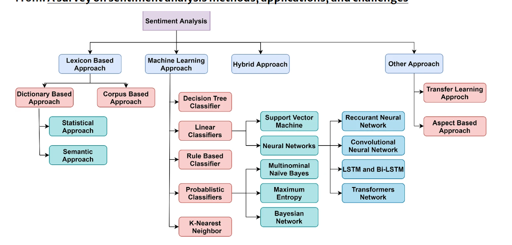

# Sposoby
  - zródło: https://link.springer.com/article/10.1007/s10462-022-10144-1/figures/4

# Pobrać dane
- biblioteka youtube_comment_downloader

# Przetłumaczyć komentarze 
- biblioteka deep_translator

# Przetworzenie danych:
- czy usuwac komentarze ktore nie maja informacji o kierowcach?
- podzielic na kierowcow i ewentualnie "No driver" przy uzyciu Named Entity Recognition np przy uzyciu spacy 
- jak podzielic komentarze ktore maja w sobie informacje o kilku kierowcach? Jesli jest "and" to podwoic komentarz z rekordem dla kazdego kierowcy z osobna, a dla "however" i "but" rozdzielic jeden komentarz na dwa? 
- usunac zbedne interpunkcje, wszystko do lowercase, czy usuwac emoji? np \ud83d \ude4f \ud83c \udffc 
- usunac stopwardy - and, but, a, an, the etc.

# Labelkowanie, a moza juz analiza sentymentalna?

Jednym ze sposobow jest ML\DL, ale potrzebne sa atykiety, wiec jak je zdobyc? pretrained model,a moze za pomoca slownikow leksykalnych obliczyc wektor nacechowania i uznac to za etykiete?